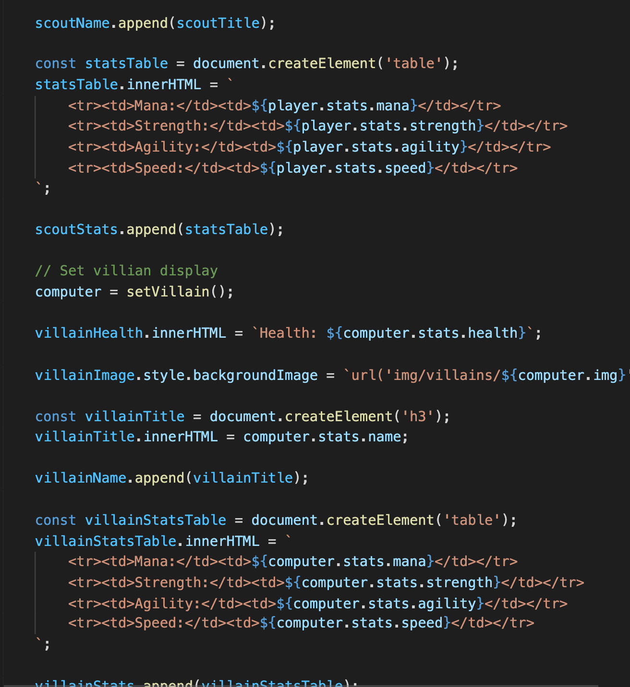
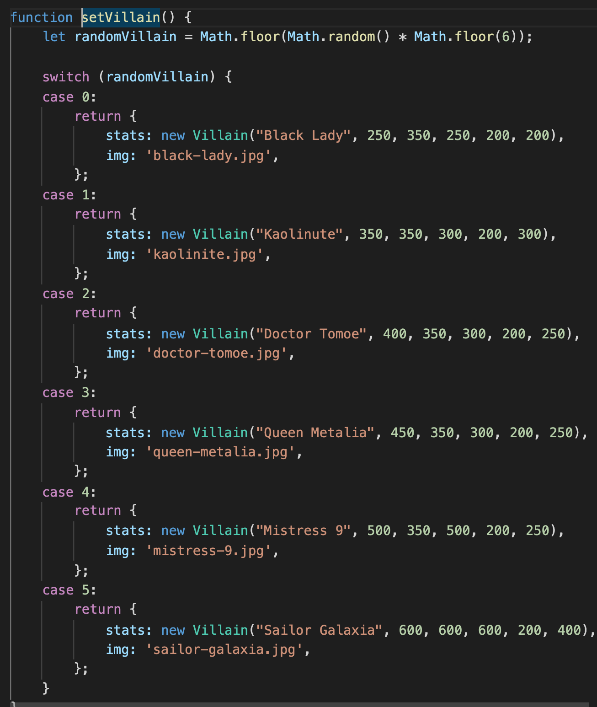
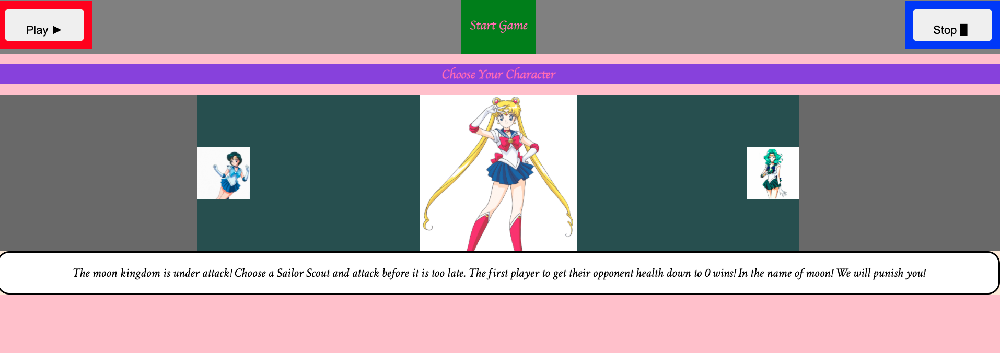
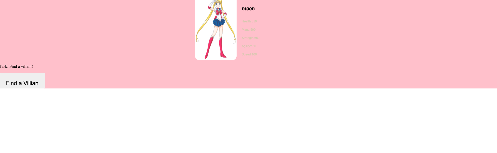

# Sailor Moon Fighter!

The game built starts with the player choosing their character or scout to fight with. The player then finds a villain and attacks until they have defended the moon kingdom from their enemies.

# HOW TO PLAY

Player chooses a sailor scout on first page to attack with. Once scout is chosen you are then taken to a battle screen to begin. Player will press "find a villain. Villain will randomize on the screen. 

Once villain is on the screen player can hit attack until villain health is down to 0 or until villain has defeated the player.

Once winner is declared press reset on top of screen to restart game and choose another scout to play with! 

## Start Up Screen:

# HOW TO INSTALL

1. *`Fork`* and *`Clone`* this respository to your local machine
2. Open `index.html` in your browser to play game! 
3. Or skip 1-2 and go to https://ariellekatherine92.github.io/sailor-moon-fighter/ and start the game!

# HOW IT WORKS

Above is a photo of the play screen where you can see who your opponent will be and who you chose are your scout to play with.

The drop down menu is where you can find the attacks specific to each scout.

The code snippet above shows how I used temperate literals to set the stats of each scout/villain. 

I used the math.floor function to randomize each villain that comes up for the player.

# FUTURE CONSIDERATIONS

There are so many things I would like to add to this game. It took me a week just to get the mechanics and basics of the game to working capacity. If I had more time however, I would really expand this to resemble a mortal combat style game. The characters could then move around screen and unleash special attacks/moves. You could choose from either scouts or villains and the game would be multi player with a leaderboard.

I would also toy with the idea of making this an app as well that people could download on their phones and play more globally.

I would have to obviously purchase some sort of licensing agreements as the characters do not belong to me however, looking into this seems to be something that could be done.

I would also like to add some other artwork and better character silhouettes.

# PROCESS WORK

## Initial Wireframes:

Here is the initial wireframe before added styling to the character page. The middle portion slides over left or right to choose a character.

Second wireframe for battle screen outlines where villain is randomized for attack. Stats of each opponent will appear next to character photo.

